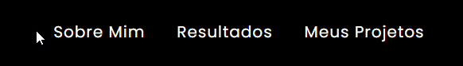
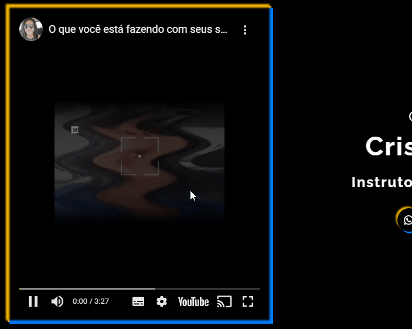
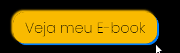

# Portfolio
Este é um Portfolio, onde é feito uma apresentação, contendo informações como Sobre mim, Habilidades, Projetos e Redes Sociais.

# Tecnologias utilizadas
- HTML;
- CSS.

# Interações com a página

### Menu
O menu tem uma interação com mudança de cores e botões clicáveis. As opções no menu levam as respectivas seções da página.

## Vídeo do YouTube

Logo no início da página, há um vídeo do YouTube que pode ser reproduzido.

### Redes sociais
Os botões das redes socias mudam de cor ao passar o cursor por cima de cada um e levam aos respectivos links que são indicados pelos ícones. É assim tanto na seção home quanto no rodapé.

### Veja meu E-Book
O botão "Veja meu E-Book" é clicável e muda de cor ao passar o cursor sobre ele. Leva para a página de acesso à compra do e-book.

### Resultados
Na seção de resultados, há um vídeo do YouTube que pode ser reproduzido, há também um botão com link que leva até a página do Google.

### Projetos
Nos projetos, ao passar o cursor no projeto as informações sobre ele aparecem em cima da imagem e, ao clicar, o primeiro e o terceiro levam para o WhatsApp, o segundo para a página de compra do e-book.

# Responsividade

### Mobile
A página se adequa em dispositivos mobiles, mudando tamanhos e orientações de elementos. 

### Tablet
A página se adequa em tablets, mudando tamanhos e orientações de elementos.

### Menu hamburguer
O menu do cabeçalho se torna um menu "hamburguer".

